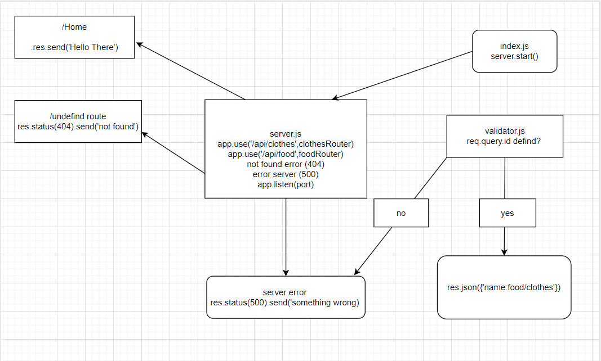

# basic-api-server

# [heroku](https://basic-api-server-zaid.herokuapp.com/)
# [PR]()

#### branch name : dev
## Feature requirement:
#### 1-We have two routes (food/clothes)
#### 2-Have ability to get data from database .
#### 3-Have ability to add in database .
#### 4-Have ability to update in database.
#### 5-Have ability to delete from database.
# Test
# [Action](https://basic-api-server-zaid.herokuapp.com/)

# UML Diagram :

# How to work with this project :
#### 1.npm init -y. 
#### 2.npm i express dotenv cors morgan uuid.
#### 3.npm i -D superagent jest.